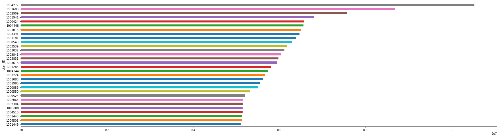
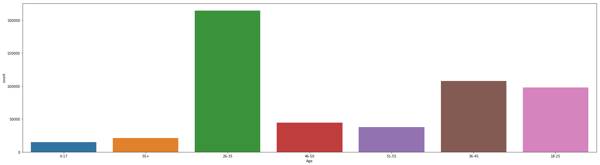
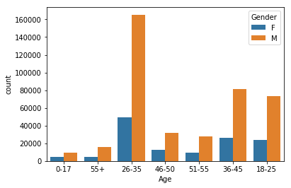
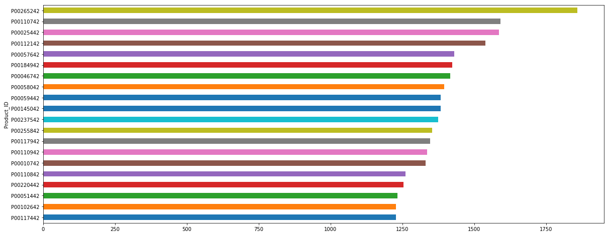
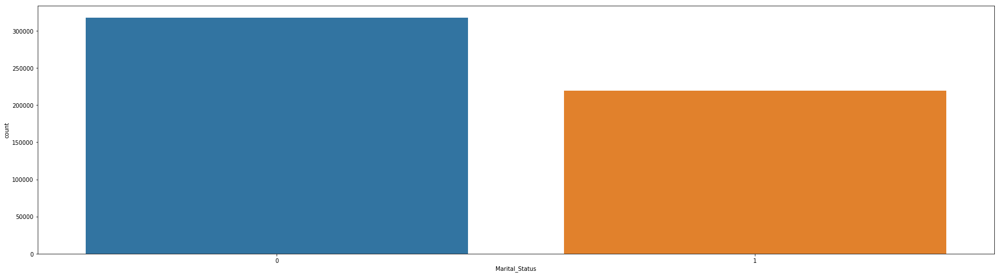

**Analysis of BlackFriday Data Set!**

Introduction

Black Friday is an amazing shopping season which has always amused me ever since i came to US. I have been curios about seeing mostly women in cloth store and men in electronics store.

I'm going to perform some exploration on Black Friday Dataset From Kaggle. The task or questions I will target for as below: 
Question 1: Which User spent most during black Friday, list the top 30 spending users 
Question 2: How are these users distributed based on their Gender and age ? 
Question 3: Which products are most popular during Black Friday, list the top 20 
Question 4: Are married couple spending more or less ?

First I imported necessary libraries for my analysis. I am using the Blackfriday dataset which I got from Kaggle for the analysis.
The dataset that I use includes 550,000 observations about Black Friday, which are made in a retail store.

For my question 1, I did analysis and data cleanup and plotted the top 30 users: Using the plot i could make out who shopped the most
Plot of Top 30 users who shopped for the blackFriday. 

For my question 2, I was curious to know what age and gender shopped the maximum.

The above plot clearly showed the age group which shopped the most. and yes its youngster group [26–35].
I wanted to see what gender is into shopping the most as well!
Graph with age and Gender plottedThis learning showed me Men shopped more than women!

For my question 3- I did an analysis and plotted the product which got sold the most.

For my question 4 - i checked if married couples shopped more than unmarried

Married vs UmmarriedConclusion
From this analysis i am showing the company, what products should they carry most for the upcoming years so that they can get more profit!

**Acknowledgments**
Thanks to Kaggle for providing the dataset!

# DSProjects

Write-A-Data-Science-Blog-Post
Project in Data Scientist Nanodegree of Udacity
Project Motivation
For this project, I was interested in the BlackFriday Dataset as a shopper who likes to shop during blackfriday:
1.	Which users did maximum purchase ? List Top 30 spending users
2.	Now lets see if we can get the age group of the users who spent more  and also what gender is shopping the most. 
3.	we will see what products are most popular during the sales event
4.	Out of curiosity I tried to see if the theory of married couple spending less is correct! 
File Descriptions 
Attaching the file which is used for analysis- I have used Python 2 as this is what I have installed in my PC. 
It also includes the results of the analysis as well. 

File Descriptions 
The notebook available here showcases work related to the above questions.
Results
Main findings of the code is also attached.
Licensing, Authors, Acknowledgements
I got the dataset from Kaggle 
